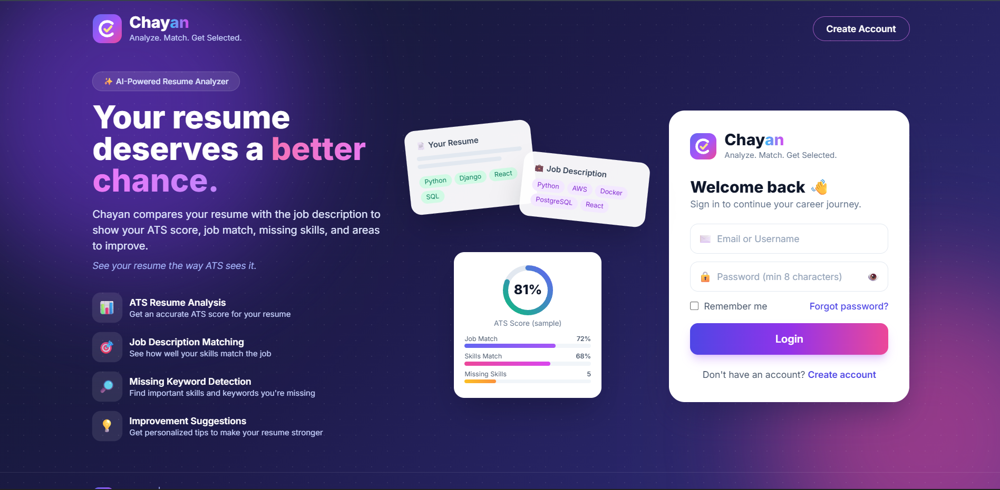
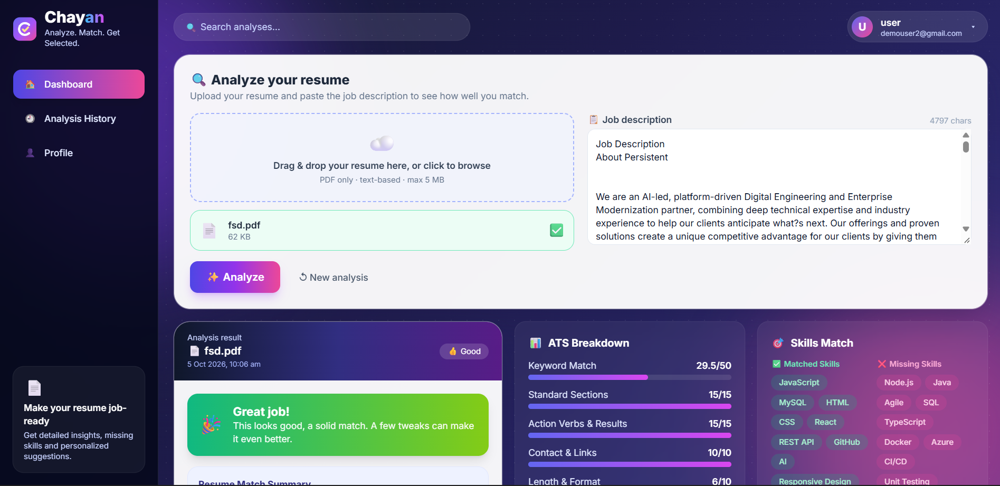

# Chayan: Resume vs Job Description Analyzer

**Analyze. Match. Get Selected.**
*See your resume the way ATS sees it.*

Chayan (Hindi for "selection") is a full-stack web app. You upload a PDF resume and paste a job description, and it shows how well they match: a match score, an ATS score with a breakdown, the skills you are missing, and prioritized tips to improve. Every analysis is saved in a history dashboard.

## Screenshots

**Login**



**Dashboard result**



**Analysis history**


## The problem
Many resumes are rejected by an Applicant Tracking System (ATS) before a human reads them, and candidates rarely know why. Chayan shows what the ATS is likely to see, so you can fix your resume before you apply.

## Features
- Sign up and log in with email or username (JWT), show/hide password, remember me, forgot password
- PDF resume upload and text extraction
- Resume-to-job-description match score (TF-IDF and cosine similarity, combined with skill coverage)
- ATS score out of 100 with a breakdown
- Matched skills and missing keywords ranked by importance, with a short explanation for each
- Improvement suggestions grouped by priority (High, Medium, Low)
- Duplicate detection: the same resume with the same job description is not analysed twice
- Score history with a progress chart, and delete for any analysis
- Download a report of any analysis (use "Save as PDF" in the print window)
- Responsive design that works on phones
- Django admin to review users and login activity

## Tech stack
| Layer | Tools |
|---|---|
| Frontend | React, Vite, Tailwind CSS (CDN build), Recharts |
| Backend | Python, Django, Django REST Framework, SimpleJWT, drf-spectacular (Swagger) |
| Database | SQLite for local use, MySQL supported through environment variables |
| NLP and parsing | pdfplumber, scikit-learn |
| Tools | Git, GitHub, Postman |

## How the scoring works
**Match score:** the job description is scanned for known skills (Python, React, Docker and so on). The score is 70% skill coverage plus 30% TF-IDF cosine similarity between the resume and the job description. If a job description has no known skills, plain TF-IDF keywords are used instead.

**ATS score (out of 100)**
| Part | Points |
|---|---|
| Keyword match with the job description | 50 |
| Standard sections (Summary, Skills, Projects, Education) | 15 |
| Action verbs and quantified results | 15 |
| Contact info and links (email, phone, LinkedIn, GitHub) | 10 |
| Length and formatting | 10 |

These scores are estimates from keyword matching and rule-based checks. They are not a guarantee of shortlisting.

## Project structure
```
chayan/
  backend/
    config/        Django settings and URLs
    analyzer/      models, views, serializers, scoring logic, migrations
    manage.py
    requirements.txt
    .env.example
  frontend/
    src/           React app (App, Auth, Dashboard, Brand, report, api, utils)
    public/        logo
    index.html
    package.json
    .env.example
  README.md
```

## Run it locally
You need Python 3.10 or newer, Node.js 18 or newer, and Git.

**1. Get the code**
```bash
git clone https://github.com/<your-username>/chayan.git
cd chayan
```

**2. Start the backend** (first terminal)
```bash
cd backend
python -m venv venv
```
Activate it: `venv\Scripts\Activate.ps1` on Windows PowerShell, or `source venv/bin/activate` on Mac and Linux. Then:
```bash
python -m pip install -r requirements.txt
cp .env.example .env          # on Windows: copy .env.example .env
python manage.py makemigrations analyzer
python manage.py migrate
python manage.py runserver
```
The API runs at http://127.0.0.1:8000 and the Swagger docs are at http://127.0.0.1:8000/api/docs/.
Optional: `python manage.py createsuperuser`, then open http://127.0.0.1:8000/admin/ to see users and login activity.

**3. Start the frontend** (second terminal)
```bash
cd frontend
cp .env.example .env          # on Windows: copy .env.example .env
npm install
npm run dev
```
Open http://localhost:5173, create an account, upload a text-based PDF resume, paste a job description and press Analyze.

## Environment variables
**backend/.env**
| Name | Purpose |
|---|---|
| `SECRET_KEY` | Django secret key |
| `DEBUG` | `1` for local development |
| `DB_ENGINE` | `sqlite` (default) or `mysql` |
| `DB_NAME`, `DB_USER`, `DB_PASSWORD`, `DB_HOST`, `DB_PORT` | MySQL settings, used only when `DB_ENGINE=mysql` |
| `CORS_ORIGINS` | Allowed frontend origin, for example `http://localhost:5173` |
| `FRONTEND_URL` | Base link used inside emails |
| `OWNER_EMAIL`, `EMAIL_HOST_USER`, `EMAIL_HOST_PASSWORD`, `NTFY_TOPIC`, `NOTIFY_LOGIN` | Optional email and phone alerts. Without them, emails are printed in the backend terminal |

**frontend/.env**
| Name | Purpose |
|---|---|
| `VITE_API_URL` | Backend API address, for example `http://localhost:8000/api` |
| `VITE_CONTACT_EMAIL` | Optional, shows a Contact link in the footer |

Never commit a real `.env` file.

## API endpoints
| Method | Endpoint | Description |
|---|---|---|
| POST | `/api/auth/register` | Create an account |
| POST | `/api/auth/login` | Log in with email or username, returns a JWT |
| GET | `/api/auth/me` | Current user |
| POST | `/api/auth/forgot-password` | Send a password reset link |
| POST | `/api/auth/reset-password` | Set a new password |
| POST | `/api/analyze` | Upload a PDF and a job description, get the analysis |
| GET | `/api/analyses` | List your analyses |
| GET, DELETE | `/api/analyses/<id>` | View or delete one analysis |

## Challenges and learnings
- **Poor keywords at first:** plain TF-IDF returned generic words like "work" and "help". I added a skills dictionary and stop-word filtering so the score reflects real skills.
- **Scanned PDFs have no text:** the app detects this and shows a clear message instead of a wrong score.
- **Same analysis twice:** I hash the PDF (SHA-256) and compare it with the job description to detect duplicates, so a changed resume still gets a new score.
- **Keeping secrets out of Git:** credentials live only in `.env` files, and only `.env.example` files with placeholders are committed.
